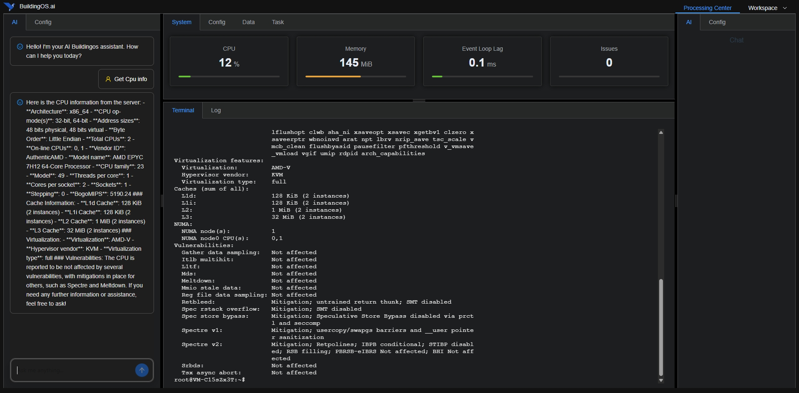

# BuildingOS AI

<p align="center">
  
</p>

BuildingOS AI is a desktop application that combines a Vue 3 frontend with a TypeScript backend server, providing AI chat capabilities and SSH terminal functionality.

## Screenshots

<p align="center">
  
</p>

## Features
- Easyway to use AI for os command
- AI chat interface powered by OpenAI and Mastra
- SSH terminal service
- Command execution tools
- WebSocket real-time communication
- Task automation scripts
- Electron desktop application packaging

## Project Structure

- `/src` - Vue 3 frontend code
- `/server` - TypeScript backend server
- `/build` - Electron desktop application configuration

## Development

### Prerequisites

- Node.js (v24.0.1 recommended)
- npm

### Frontend Development

```bash
# Install dependencies
npm install

# Start development server
npm run dev

# Build for production
npm run build
```

### Backend Development

```bash
# Navigate to server directory
cd server

# Install dependencies
npm install

# Start development server
npm run dev

# Build for production
npm run build
```

### Environment Variables

Create a `.env` file in the server directory with the following variables:

```
PORT=3003
OPENAI_API_KEY=your_openai_api_key_here
SSH_HOST=your_ssh_host
SSH_PORT=22
SSH_USERNAME=your_username
SSH_PASSWORD=your_password
```

## Building Desktop Application

The project includes an Electron-based desktop application build system:

```bash
# Run the build script to create a Windows executable
node build.js
```

The Windows executable will be available in the `build/release` directory.

## Technologies

- Frontend: Vue 3, Vite, Element Plus, Ant Design Vue
- Backend: Node.js, Express, WebSocket
- Terminal: Xterm.js
- AI: OpenAI, Mastra
- Desktop: Electron

## License

MIT


